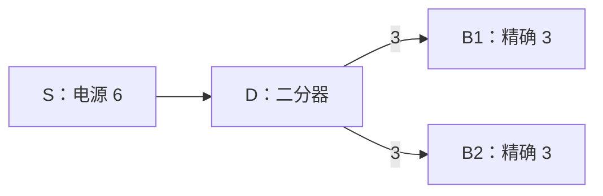
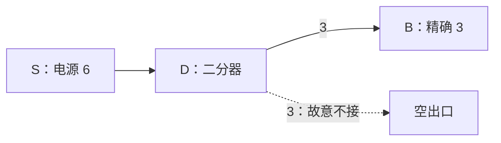
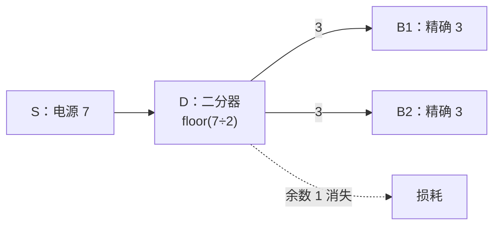
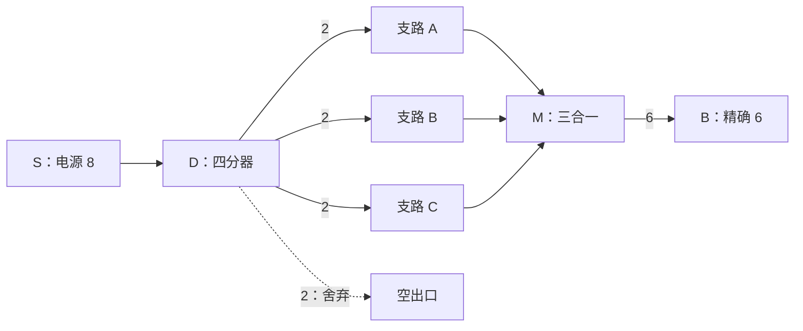

# 修理电路关卡原型：节点与美术包装需求

> 文档定位：作为《修理电路关卡设计指南》的配套内容白皮书，供策划整理关卡题面，并向美术提出可评估、可拆分的包装需求。
>
> 关联设计：`修理电路关卡设计指南.md`（Unity 工程内 `Assets/Developers/taslopece/MiniGame_Electric/`）。原型编号 A–J 与该指南一致；本文件不替代其规则说明与关卡配置模板。
>
> 状态：包装方向与节点清单建议，需在首批可玩关卡验证后与美术确认最终资产范围。

---

## 1. 用途与共识

修理电路是“修理家具内部回路”的空间谜题，而非抽象电路板。美术包装的目标不是装饰画布，而是帮助玩家一眼辨认：**哪儿供电、哪儿需要供电、线路为什么在这里拐弯或被阻断、当前电量是否正确**。

每个原型均按以下三类节点列出需求：

| 分类 | 在题面中的角色 | 美术沟通重点 |
|---|---|---|
| 电源节点 | 固定的输入能量来源 | 设备内的供能部件；输出 Pin、数值和朝向必须清楚 |
| 电池节点 | 固定的待修复目标 | 设备功能部件；未通电、供电中、正确点亮、过量/错误四态可读 |
| 中转节点 | 预置或从件库摆放的连线功能件 | 功能轮廓、Pin 朝向、分组关系优先于写实细节 |

### 1.1 首批共用节点资产（建议先做）

| 节点 | 玩法功能 | 最小包装需求 |
|---|---|---|
| 电源 | 每个输出 Pin 提供固定电量 | 电源本体、单/双输出面板、Pin 插口、数值承载区、激活发光态 |
| 电池/受电器 | 按目标数值检查是否点亮 | 受电器本体、需求数值区、未亮/半亮/正确点亮/错误或过载态 |
| 直通件 | 1 入 1 出，直通或转向 | 直线、L 形两种轮廓（或同一件的明确朝向变体）；双端 Pin |
| 十字件 | 两组独立线路空间交叉 | 清晰的上下/左右两层线槽或桥架；两组必须用轮廓或色带区分，避免误解为合流 |
| 二分器 | 1 入 2 出，平均分配 | 一入两出的 Y 形/分线盒轮廓；两个输出端同等可见 |
| 三分器/四分器 | 1 入多出，制造更强分流与损耗 | 扇出结构；每个输出端编号或同级标识，不能只画装饰孔 |
| 二合一/三合一 | 多入 1 出，输入求和 | 汇流盒/总线盒轮廓；多个输入端向同一输出端收束 |
| 导线 | 玩家手画、逐格占用 | 未接通、通电、非法预览、预算耗尽四种表现；转角与端点衔接清楚 |

**Demo 裁剪建议**：首轮正式可玩内容至少需要电源、电池、直通/转向、二分器、二合一与十字件；三分/四分器、三合一可先以风格一致的预留规格交付，等综合关确认后再细化。

---

## 2. 原型逐关：节点与包装需求

图示图例：`S` = 电源，`B` = 电池/受电器，`L` = 直通或转向件，`D` = 分流器，`M` = 合流器，`X` = 十字件，`■` = 不可走的设备结构。图中的连线表示原型希望玩家发现的结构关系，不等同于最终逐格配置；正式制作时仍需在关卡编辑器中记录坐标、Pin 朝向与导线格数。

### A. 第一次通电

**教学目的**：理解“电源 → 导线 → 电池”，并观察即时点亮。

**原型图示**：

```text
┌─────────────────────────────┐
│  [S:5] ─────────── [B:=5]  │
└─────────────────────────────┘
       玩家只需完成一条直连导线
```

| 项目 | 关卡节点需求 | 美术包装需求 |
|---|---|---|
| 固定题面 | 1 个单输出电源（5）；1 个电池（需求 5，允许过量） | 同一小设备内成对出现，如台灯的电源模块与灯泡；用柔和未亮→暖光点亮建立正反馈 |
| 件库 | 无中转件 | 不需要件库教学，降低首屏信息量 |
| 画布/障碍 | 平直、宽松的可连通区域 | 设备轮廓只做背景，不在电源与电池之间制造视觉干扰 |
| 特殊反馈 | 导线接通后立刻点亮 | 导线电流流光、灯泡/指示灯亮起；需求数值和收到数值靠近目标显示 |

### B. 拐弯与空间占用

**教学目的**：理解导线与节点都占格，首次使用转向件。

**原型图示**：

```text
┌──────────────────────────────┐
│  [S:5] ─────┐  ■ ■ ■ ■ ■   │
│              │  ■       ■   │
│              [L]──── [B:=5] │
└──────────────────────────────┘
        直连被阻断，必须落下转向件
```

| 项目 | 关卡节点需求 | 美术包装需求 |
|---|---|---|
| 固定题面 | 1 个单输出电源；1 个电池；1 处阻断直连的设备结构/不可走区域 | 以设备外壳、散热片或断裂导槽表现“这里不能穿线”，不能看起来像可交互节点 |
| 件库 | 1 个 L 形转向件（或明确为转向用途的 1 入 1 出件） | 转向件应有清楚的线槽走向和两个 Pin；放置预览需能看清朝向 |
| 画布/障碍 | 迫使一次转向即可，但保留少量摆放容错 | 障碍边缘与可走格对比明确；避免纯靠低对比背景藏路径 |
| 特殊反馈 | 节点落位合法/非法 | 合法吸附轮廓、非法红色半透明遮罩；这一关首次把“元件占位”说清楚 |

### C. 二分点亮两块电池

**教学目的**：理解整除的平均分配（6 → 3 + 3）。

**原型图示**：



| 项目 | 关卡节点需求 | 美术包装需求 |
|---|---|---|
| 固定题面 | 1 个电源（6）；2 个电池（各需求 3） | 两个并列的同类受电部件，如一对小灯/双仪表；避免将它们画成主次目标 |
| 件库 | 1 个二分器 | 一入二出的对称 Y 形或分线盒，两个输出 Pin 等权、等大、等清晰 |
| 画布/障碍 | 从分流点到双目标的两条自然支路 | 可用设备内的双股线槽暗示分支，但不能替玩家画出唯一答案 |
| 特殊反馈 | 分流后两条线均显示 3 | 分流器本体或两条出线显示同步数值；第一次出现“电量被拆开”的可视化 |

### D. 空出口也是工具

**教学目的**：理解未接输出口仍参与分流，可主动浪费电量。

**原型图示**：



| 项目 | 关卡节点需求 | 美术包装需求 |
|---|---|---|
| 固定题面 | 1 个电源（6）；1 个精确电池（需求 3，不允许过量） | 单一目标明确显示“精确 3”；不要以大量装饰目标分散对空出口的注意力 |
| 件库 | 1 个二分器 | 第二个输出 Pin 需完整外显，且在未连接时仍有“分配出去但悬空”的弱提示 |
| 画布/障碍 | 给未使用出口留出视觉呼吸，不强迫接入假目标 | 可用空置端子/开放线槽承接“未接也合理”的语义，避免像漏做了一条线 |
| 特殊反馈 | 一端接电池、另一端悬空时电池正确点亮 | 分流器两侧都显示 3；悬空侧显示柔和逸散/未接端提示，而不是报错红态 |

### E. 分流余数

**教学目的**：理解向下取整与余数损耗；进阶题可通过额外损耗获得精确值。

**原型图示（基础题）**：



**进阶变体**：把电源改为 8 后，直接二分会得到 4 + 4，两块精确 3 的电池均不亮；需要再组合已教学的分流/空出口损耗规则。该变体的具体件库要在解法证明完成后再定，避免美术按一个尚未验证的唯一解制作构图。

| 项目 | 关卡节点需求 | 美术包装需求 |
|---|---|---|
| 固定题面 | 基础题：电源（7）、2 个精确电池（各 3）；进阶变体：电源（8）、2 个精确电池（各 3） | 电源数值应高可读；两个电池使用同类外观，避免把数值差异误归因为外观差异 |
| 件库 | 基础题：1 个二分器；进阶变体：二分器 + 能制造额外损耗的分流路径 | 分流器保留清晰的整数分配信息区；不要只靠小数动画表达“余数消失” |
| 画布/障碍 | 基础题空间宽松；进阶题为额外损耗件预留可摆位置 | 可用溢流槽、泄压口等设备语义包装损耗，但不应让其看似必接目标 |
| 特殊反馈 | 7 ÷ 2 的两路均为 3，余数 1 消失 | 用简短数值变化/逸散粒子说明余数损耗；避免强烈爆炸或故障感，保持低压力 |

### F. 先拆再合

**教学目的**：理解分流可用于“改数”，之后再通过合流得到目标值。

**原型图示**：



| 项目 | 关卡节点需求 | 美术包装需求 |
|---|---|---|
| 固定题面 | 1 个电源（8）；1 个精确电池（需求 6） | 目标可包装为需稳定六格供能的核心部件，如加热盘/控制芯片 |
| 件库 | 1 个四分器；1 个三合一；必要的直通/转向件 | 四分器表现为均分总线，三合一表现为汇流总线；两者轮廓必须明显不同，防止玩家混淆输入输出 |
| 画布/障碍 | 三条支路从分流器可汇向合流器，第四支路可自然闲置 | 以三条并列线槽和一个未占用端子组织构图，减少“把哪三路合回去”的阅读成本 |
| 特殊反馈 | 8 → 2×4，其中 3 路合为 6 | 分流端显示四路 2，合流后显示 6；这是综合反馈，建议节点本体有小型数值牌位 |

### G. 多电源拼数

**教学目的**：理解多电源组合与输出口不可复用带来的取舍。

**原型图示**：

```text
┌────────────────────────────────────────┐
│ [S:2] ──┐                 ┌── [B:=5]  │
│          ├── [M:二合一] ──┤           │
│ [S:3] ──┘                 └── 候选组合 │
│                                        │
│ [S:5] ──────────────────── [B:=7]     │
└────────────────────────────────────────┘

数值候选：2+3=5，2+5=7。
但 S:2 只有一个输出 Pin，不能同时服务两套组合；
题面由此产生“保底点亮哪一块／是否用分流寻找完整解”的取舍。
```

| 项目 | 关卡节点需求 | 美术包装需求 |
|---|---|---|
| 固定题面 | 3 个单输出电源（2、3、5）；2 个电池（需求 5、7） | 三个供能模块可做成不同大小的蓄能块，但必须统一“数值才是差异”的阅读方式；两个目标并列可比较 |
| 件库 | 至少 1 个二合一；若设计完整解需要复用/拆分，再给二分器 | 合流器输入端数量要直观；电源 Pin 被占用后需有明确锁定/已接线状态 |
| 画布/障碍 | 让不同合流组合在空间上也有代价，避免只做算术题 | 三个电源与两个目标形成三角或错位布局；背景可用不同设备腔室暗示路线而不封死多解 |
| 特殊反馈 | 电源输出被一条线占用后，其他尝试不可再从同 Pin 拉线 | Pin 插口出现已占用塞头/锁定环；失败提示说明“该接口已连接” |

### H. 单格桥与十字立交

**教学目的**：理解空间带宽；两条线路交叉时使用十字件而不混线。

**原型图示**：

```text
┌────────────────────────────────┐
│ [S:A] ─────────┐      [B:B]   │
│  ■ ■ ■ ■ ■ ■  │  ■ ■ ■ ■   │
│                [X]             │
│  ■ ■ ■ ■ ■ ■  │  ■ ■ ■ ■   │
│ [B:A]      └───┘────── [S:B]  │
└────────────────────────────────┘
       X 内横线与竖线分属不同 PinGroup
```

也可把中间区域收窄成单格桥：使用十字件是省线解，沿画布外缘绕行是消耗更多导线预算的替代解。

| 项目 | 关卡节点需求 | 美术包装需求 |
|---|---|---|
| 固定题面 | 2 组电源—电池配对（数值可相同以降低算术负担） | 端点用 A/B 色带或简洁图形标识辅助追线；不能只靠红绿区分，以兼顾色觉可读性 |
| 件库 | 1 个十字件；必要时少量直通/转向件 | 十字件要有清楚的上下桥/绝缘层结构，明确“交叉但不相通”；四个 Pin 的成对关系可用线槽颜色或形状标识 |
| 画布/障碍 | 单格窄道或对角端点布局，十字为短解、绕行是耗线替代解 | 设备内的狭窄桥位、双层排线板或管路交汇区；可走格与不可走结构边界要清晰 |
| 特殊反馈 | 两路在十字件内独立通电 | 两组电流分别流动，不出现混色；十字件两层线槽可依次亮起以强化独立性 |

### I. 固定骨架维修

**教学目的**：把题面读作一套已有但损坏的设备，判断保留、移动与补件。

**原型图示**：

```text
┌────────────────────────────────────┐
│ [S:6] ── [L:固定] ──╳── [D:可拆] │
│                         ├── [B:=3] │
│                         └── [B:=3] │
│                                    │
│ 件库：[L ×1]   [关键中转件 ×1]    │
└────────────────────────────────────┘
  ╳ 表示骨架中的断点；玩家决定保留、移动或补齐哪些旧件
```

图中只是固定骨架原型。正式关应明确标出：哪些中转件固定、哪些可移动、哪些可删除，以及移动后被拆除的导线是否计入原解法预算。

| 项目 | 关卡节点需求 | 美术包装需求 |
|---|---|---|
| 固定题面 | 电源与电池；若干预置中转件，其中部分不可移动、部分可移动/可删除 | 预置件需区分“固定在设备里的原装部件”和“可拆维修模块”；仅用锁形图标不足，轮廓材质/底座也应区分 |
| 件库 | 1–2 个关键中转件，按考点选择二分、合流、十字或转向 | 件库模块与预置可拆模块保持同一视觉语言，表示它们可互换；不可拆件不应被误读为件库来源 |
| 画布/障碍 | 预置骨架构成可读但不完整的线路，避免做成随机障碍堆 | 背景可表现为打开的家具后盖、旧排线与损坏端子；故障痕迹克制，不做高压惊悚感 |
| 特殊反馈 | 移动/删除中转件会拆除其附着导线并返还预算 | 拆线时给出温和断开动画和预算回退；预置固定件不显示可拖动高亮 |

### J. 部分完成与多解

**教学目的**：在低压力下提供普通解、优化解与完美解。

**原型图示**：

```text
                    ┌── [B1]
[S1] ── 基础支路 ───┤
                    └── [B2]       2/4 = 50 分保底解

                    ┌── [B3]       增加合流/绕行后
[S2] ── 优化支路 ───┤               3/4 = 75 分优化解
                    └── [B4]

共享中转件 + 十字件 + 更紧凑路线     4/4 = 100 分完美解
```

最终题面应把四块电池放在同一设备的四个可辨识功能区中。图示表达的是三档完成结构，不代表已经拍板的电源数值或唯一走线；这些内容需要随策划解法证明一并冻结。

| 项目 | 关卡节点需求 | 美术包装需求 |
|---|---|---|
| 固定题面 | 建议 2–3 个电源；4 个电池；按题目组合配置数值与空间位置 | 4 个目标应组成一个完整家具/设备的四个功能区，例如四盏壁灯或四路控制单元；逐个点亮能看见整体逐渐恢复 |
| 件库 | 综合使用：转向、二分、二合一、十字；按最终解再加入三分/三合一 | 件库图标优先功能辨识与余量读数；综合关不宜同时引入尚未教学的新外观语义 |
| 画布/障碍 | 同时给出容易达成的局部路径与更紧凑的全局路径；导线预算为完美解留合理容错 | 背景以较完整的设备内部结构组织区域，避免格子过密导致纯视觉噪音 |
| 特殊反馈 | 2/4、3/4、4/4 均可提交，转换为 50/75/100 分 | 顶部进度以“已修复部件数”表达；完成页强调修复程度与访客反馈，而非失败/惩罚 |

---

## 3. 按美术交付拆包

### P0：保证原型 A–D 可教学

- 通用画布底图、可走格、不可走结构、Pin、导线四态。
- 电源与电池各 1 套基础皮肤，电池至少具备未亮、正确点亮、供电错误三态。
- 直通/转向件、二分器，以及件库图标与节点内大图两种规格。
- 首个“可打开维修”的家具设备背景：外部家具概览 + 内部电路画布 + 元件层。

### P1：保证原型 E–H 的机制组合

- 二合一、三合一、三分/四分器、十字件。
- 损耗、精确供电、Pin 已占用、预算不足、非法连线等状态提示的视觉规范。
- 可复用的线槽、阻隔件、窄桥、双层交汇、溢流口等环境模块。

### P2：服务叙事与完整维修感

- 固定骨架的旧件/可拆件/新件差异化材质与状态。
- 至少一套随点亮数量逐步恢复的家具表现（灯光、指针、蒸汽、微动机关等）。
- 与访客需求关联的设备主题变体；优先从 Demo 的三位访客和核心房间中选，而非为每个原型单独做全新家具。

---

## 4. 向美术提需求时需要一并确认的规格

1. **节点尺寸与留白**：节点会占格，Pin 也需要可点选；先由程序给出标准格尺寸、最小 Pin 热区和九宫格拉伸规则，美术再定轮廓细节。
2. **状态优先级**：正确通电、错误供电、可放置、不可放置、已占用 Pin、预算不足不能只靠颜色区分；至少叠加图标、轮廓或动效之一。
3. **数值承载区**：电源输出、电池需求/收到量、导线电量均需要稳定文字区域。美术不应把关键读数烘焙进不可替换图片。
4. **分组可读性**：十字件和多 Pin 中转件必须让玩家看出哪些 Pin 同组导通；这是规则信息，不是可有可无的装饰。
5. **三层关系**：每个设备至少考虑底层（设备外壳/轮廓）、中层（内部元件/不可走结构）、表层（可拖节点与导线），避免用一张背景图吞掉交互边界。
6. **主题复用**：功能节点保持统一结构，优先通过外壳、材质、背景元件和点亮结果替换主题；不要为每一关重做一套难以辨识的功能符号。

---

## 5. 制作前检查

- [ ] 每一关先填写《修理电路关卡设计指南》中的题面与解法证明，再申请对应节点包装。
- [ ] 首批件库已确认包含关卡实际要用的中转件；不以空件库资产作为原型验收依据。
- [ ] 每个节点的 Pin 位置、朝向、分组与美术稿逐项对齐。
- [ ] 数值、状态、失败原因在无美术占位版中已经可读，再叠加最终包装。
- [ ] 关卡背景没有制造“看似可走、实际不可走”或“看似连接、实际不导通”的歧义。
- [ ] 部分完成关已定义普通解、优化解、完美解分别点亮哪些设备部件。

## 6. 当前范围提醒

本文件基于当前修理电路实现能力整理。开关、延迟、不同电属性、旋转中转件、拖动已有导线和跨局保存电路均不在当前内容生产范围内；若美术希望围绕这些能力设计包装，需要先立项程序扩展，不能仅通过补资产实现。
