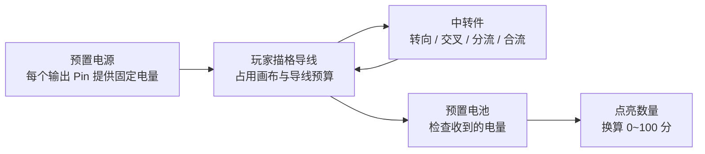
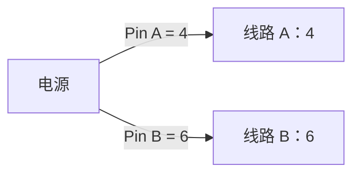
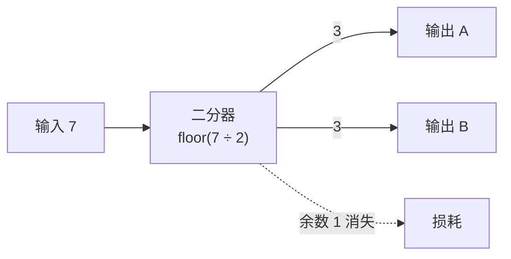
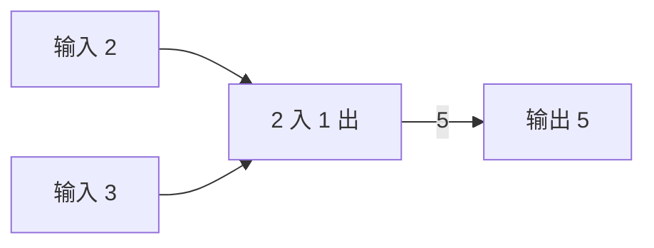
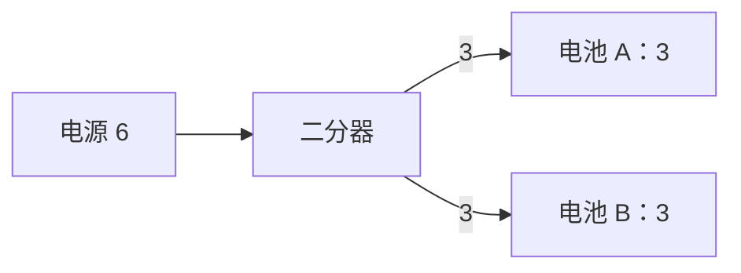
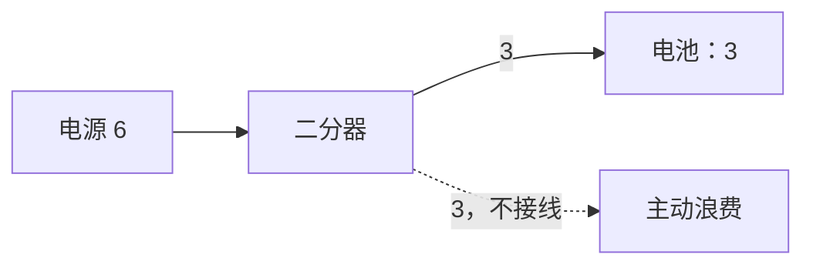
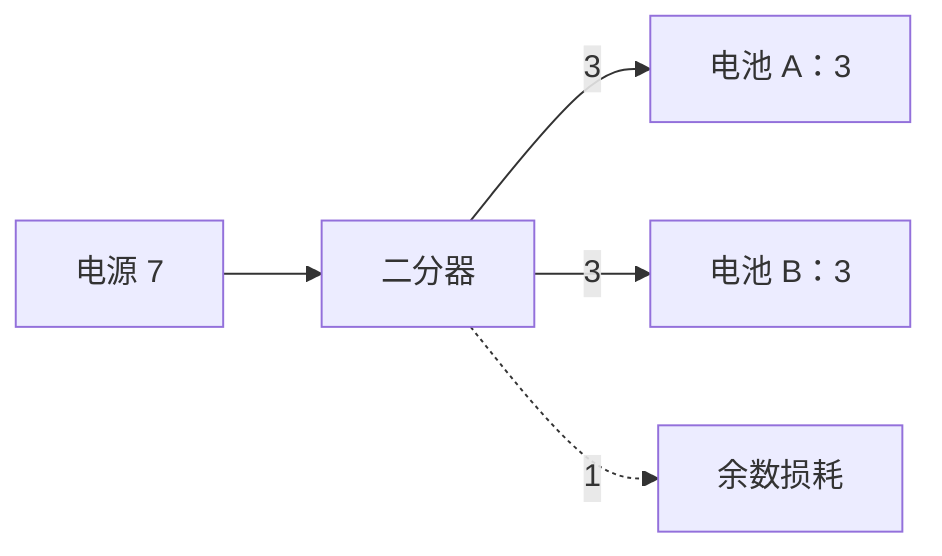
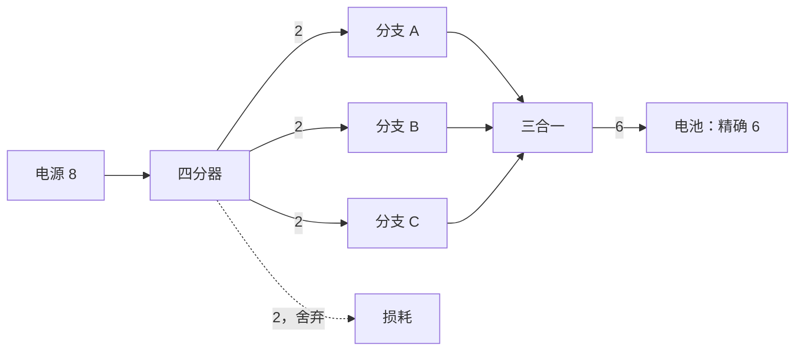

# 修理电路关卡设计指南

> 文档定位：面向策划、程序、美术与测试的关卡设计共识，用来解释当前规则能产生什么玩法、如何搭建难度、如何验证一关是否公平且可读。
>
> 当前版本：2026-08-15。规则口径以当前工程 `Minigame/Circuit` 实现为准；本文件中的关卡草图是设计示例，不代表已经制作成资产。

---

## 1. 一句话理解这套玩法

修理电路不是持续运行的生产模拟，而是一个**即时求解的空间电路谜题**：

> 玩家在有限画布中摆放有限数量的中转件、手动画有限长度的导线，把预置电源的电量准确送到尽可能多的电池。

每次摆件、移动、删件、接线或删线后，系统立即重新计算全场电量；没有 tick、运输时间、库存、背压或挂机产出。



这套玩法的可玩性来自四个维度同时成立：

| 维度 | 玩家面对的问题 |
|---|---|
| 空间 | 线与节点都占格，怎样绕开障碍、避免互相堵死？ |
| 算术 | 怎样通过分流、合流与有意浪费，得到电池需要的数值？ |
| 拓扑 | 哪些线路该先汇合、后拆分？两路电怎样交叉而不混线？ |
| 预算 | 有限导线与有限中转件应该花在哪里，是否值得追求满分？ |

---

## 2. 策划必须掌握的硬规则

### 2.1 电源：每个输出口独立供电

电源通常是不可移动、不可删除的预置题面。每个输出 Pin 的 `MaxRate` 就是该口送出的电量，一个 Pin 至多接一条线。



上图代表两个独立出口分别提供 4 和 6，不是整台电源共享一个“总功率 10”的池。

设计含义：

- 多输出电源天然产生“端口分配”问题；
- 一个输出口不能同时直连多个目标，必须使用分流器；
- 电源位置、Pin 所在格与朝向，和电量本身同样重要。

### 2.2 中转件：统一公式产生三种件型

所有中转件共用同一个计算规则：

```text
每个输出口的电量 = floor（同组输入总量 ÷ 同组输出口总数）
```

Pin 通过 `PinGroup` 分组；只有同组 Pin 会互相导电，不同组互不影响。

#### 直通、转向与十字

一个组有 1 个输入、1 个输出时，电量原样通过。


十字件由两个互不相通的 1 入 1 出分组组成：

```text
             B 组
              │
              │
A 组 ───── [ 十字 ] ───── A 组
              │
              │
             B 组

A、B 只在空间上交叉，电量不会混在一起。
```

#### 分流

一个组有 1 个输入、N 个输出时，输入被平均分配并向下取整。



特别重要：分母是**配置的输出口总数**，不是已经接线的输出口数。二分器即使只接一个输出口，该口仍只得到一半；另一个未接出口的份额会浪费。

#### 合流

一个组有 N 个输入、1 个输出时，所有已连接输入相加。



### 2.3 电池：最低供电或精确供电

电池通常是不可移动、不可删除的预置目标。它把所有输入 Pin 收到的电量相加，再检查 `Conditions`。

一条条件包含：

- `RequiredAmount`：要求电量；
- `AllowExcess`：是否允许过量。

| 收到电量 | 要求 5，允许过量 | 要求 5，不允许过量 |
|---:|---|---|
| 4 | 不亮 | 不亮 |
| 5 | 点亮 | 点亮 |
| 6 | 点亮 | 不亮 |

建议当前每块电池只配一条条件。代码虽然保留条件列表，但所有条件检查的是同一个“总收到电量”；在还没有多种电属性时，多条条件通常只会制造难懂的重复约束。

### 2.4 空间、导线与连接

- 节点占据自身形状覆盖的每个格子；形状可以不是矩形；
- 导线占据路径中的每个格子；
- 导线不能越出画布、穿过节点、经过其他导线，也不能与自身重叠；
- 路径必须四方向连续；
- 一个 Pin 至多接一条线；
- 不允许连接同一节点的两个 Pin；
- 会形成电路回环的连接会被拒绝；
- 两个都尚未确定方向的“同步”中转口不能直接互连，因为系统无法判断电流方向。

### 2.5 两种关卡预算

| 配置 | 作用 | 0 的含义 |
|---|---|---|
| `BuildableNodes[].MaxCount` | 每种中转件在场上允许存在的总数 | 不应配置 0；编辑器要求至少 1 |
| `MaxLinkCells` | 全部导线路径格数之和的上限 | 不限 |

导线预算耗尽时，正在描画的线会像撞墙一样停止延伸；删除导线会立即返还对应预算。

从件库摆出的中转件可以移动和删除。移动或删除中转件时，它身上连接的导线会直接删除并返还预算，不保留“断线”状态。

### 2.6 计分与退出

```text
分数 = round（点亮电池数 ÷ 电池总数 × 100）
```

| 电池数 | 可能出现的分数 |
|---:|---|
| 1 | 0 / 100 |
| 2 | 0 / 50 / 100 |
| 3 | 0 / 33 / 67 / 100 |
| 4 | 0 / 25 / 50 / 75 / 100 |

玩家可以随时点击完成，没有传统“失败状态”。放弃或按 ESC 不结算，再次进入会重置局面；同一位访客重新进入时仍会抽到同一张关卡，不能靠反复退出刷题。

---

## 3. 这套规则提供的六个基本解题动作

| 动作 | 玩家理解 | 依赖规则 |
|---|---|---|
| 绕行 | 找到不冲突且省线的空间路径 | 导线逐格占用 |
| 转向 | 用中转件改变接线方向与端口位置 | 1 入 1 出分组 |
| 交叉 | 让两条线路在同一位置跨越但不混线 | 十字件的两个独立分组 |
| 分流 | 把一份电送往多个目标 | `floor(输入/N)` |
| 合流 | 把多个小电源拼成一个目标值 | 输入求和 |
| 损耗 | 利用空出口或整除余数主动丢掉多余电 | 输出口总数参与分母 |

优秀关卡通常不是只考一个动作，而是让两个动作产生冲突。例如：数学上应该先合流，但空间上合流点会堵住唯一通道；或者最短路径需要十字件，但十字件数量只够解决一处交叉。

---

## 4. 可直接落地的关卡原型

### 4.1 原型 A：第一次通电

**目的**：让玩家理解电源、导线、电池与即时点亮。

```text
[电源 5]  ─────────  [电池 =5]
```

设计建议：

- 不提供中转件；
- 导线预算宽松；
- 电池允许过量，避免第一关同时教“精确值”；
- 电源和电池保持同一水平线。

### 4.2 原型 B：拐弯与空间占用

**目的**：第一次使用 1 入 1 出中转件。

```text
[电源] ──┐      墙墙墙
         └─[转向]── [电池]
```

让直接线路被画布缺口或节点形状挡住，玩家必须把中转件摆在可接线的位置。

### 4.3 原型 C：二分点亮两块电池

**目的**：教学平均分配与向下取整。



第一道分流题应使用整除数字，不要同时引入余数损耗。

### 4.4 原型 D：空出口也是工具

**目的**：让玩家理解“未接输出口仍参与分流”。



这是当前规则最容易产生“原来还能这样”的时刻，但必须先给出明确视觉反馈，否则玩家会把它当成 Bug。

### 4.5 原型 E：分流余数

**目的**：用向下取整完成精确供电。



反题可以把电源换成 8、两块电池仍要求精确 3。直接二分得到 4/4 全部失败，迫使玩家寻找额外损耗路径。

### 4.6 原型 F：先拆再合

**目的**：打破“分流只用于服务多个目标”的直觉。



这是很强的综合题，但需要分流器、合流器和损耗规则都已经分别教学。

### 4.7 原型 G：多电源拼数

**目的**：让线路选择成为组合问题。

```text
电源：2、3、5
目标：电池 A = 5，电池 B = 7

候选组合：
2 + 3 = 5
2 + 5 = 7
```

如果每个电源只有一个输出口，两组组合不能同时复用“2”。玩家必须寻找分流、其他组合或接受部分得分。

### 4.8 原型 H：单格桥与十字立交

**目的**：把空间看作有限带宽。

```text
电源区  ═══ 单格通道 ═══  电池区
```

或者把两组端点对角放置：

```text
电源 A                         电池 B

                   ×

电池 A                         电源 B
```

最短路径必然相交，玩家必须使用十字件，或者用更长的绕行路径消耗导线预算。

### 4.9 原型 I：固定骨架维修

**目的**：让题面更像“维修现有设备”，而不是从空白搭建。

- 预置若干不可移动的中转件，形成损坏骨架；
- 预置少量可移动中转件，让玩家重排；
- 件库只补一两个关键部件；
- 玩家要判断哪些旧结构值得保留。

注意：当前程序按类型硬限制电源和电池不可移动；只有预置中转件的 `CanMove` / `CanDelete` 会真正生效。

### 4.10 原型 J：部分完成与多解

摆 4 块电池，让简单方案点亮 2 块、优化方案点亮 3 块、完美方案点亮 4 块：

| 结果 | 分数 | 体验定位 |
|---|---:|---|
| 点亮 2/4 | 50 | 玩家理解了基础规则，可以交卷 |
| 点亮 3/4 | 75 | 找到了更好的资源分配 |
| 点亮 4/4 | 100 | 同时解决数学、空间与预算优化 |

这种结构符合项目的低压力方向：不把普通玩家卡死，同时给喜欢钻研的玩家留下完美解。

---

## 5. 推荐教学曲线

| 关卡 | 新教学点 | 已掌握内容 | 建议限制 |
|---:|---|---|---|
| 1 | 直接画线与点亮 | 无 | 无中转件，预算宽松 |
| 2 | 转向件与导线占格 | 直接连接 | 只给 1 个直通/转向件 |
| 3 | 二分器 | 转向、占格 | 使用可整除数字，如 6→3+3 |
| 4 | 空出口损耗 | 二分 | 只要求点亮 1 块精确电池 |
| 5 | 合流器 | 分流、损耗 | 两个小电源合成一个目标值 |
| 6 | 十字件 | 前述全部 | 两条线路强制相交 |
| 7 | 综合维修 | 全部 | 有限导线、有限件库、分档得分 |

教学原则：

1. 一关只引入一个新规则；
2. 新规则第一次出现时，正确操作应产生立即且明显的电量反馈；
3. 下一关再让新规则与旧规则产生冲突；
4. “空出口参与分母”“余数消失”“过量不亮”必须显式教学，不能靠玩家猜代码。

---

## 6. 难度旋钮与副作用

| 旋钮 | 调高难度的方式 | 常见副作用 |
|---|---|---|
| 画布形状 | 增加窄道、凹槽、孤岛和不可穿越区域 | 容易变成纯试错找路 |
| 端点位置 | 拉远电源与电池、制造交叉 | 可能只是在增加操作长度 |
| Pin 朝向 | 把接口朝向受限空间 | 若缺少预览，会显得阴险 |
| 电源数值 | 使用质数、非整除数、不同端口值 | 算术负担可能超过空间乐趣 |
| `AllowExcess` | 从最低门槛改为必须精确 | 必须提供清晰的收到/需求数值 |
| 电池数量 | 增加并行目标与评分粒度 | UI 信息量和线路密度上升 |
| 中转件上限 | 减少关键件，迫使共享结构 | 太紧会形成唯一解且难以诊断 |
| 导线预算 | 压缩到必须走近似最短路 | 差一格时容易产生挫败感 |
| 固定中转骨架 | 限制玩家可改区域 | 错误骨架过多会像清垃圾 |

建议先确定关卡主要考察哪两个维度，再配置其他旋钮。一个小关同时把空间、算术、预算和端口方向都拉满，通常不是“深”，而是信息噪音。

---

## 7. 一张关卡的设计模板

### 7.1 设计意图

```text
关卡名：
目标教学／考点：
期望玩家的“顿悟”：
最低可接受结果：
完美解额外要求：
```

### 7.2 题面清单

```text
画布尺寸与特殊形状：
预置电源：位置 / Pin 朝向 / 各口电量
预置电池：位置 / 输入口 / RequiredAmount / AllowExcess
预置中转件：位置 / 是否可移动 / 是否可删除
件库：NodeDef / MaxCount
导线预算 MaxLinkCells：
```

### 7.3 解法证明

每关至少保留一份策划解法记录：

1. 电量如何从源头变成各目标值；
2. 每个中转件为什么必要；
3. 每条导线大致走向；
4. 总导线格数；
5. 是否存在更短或更少件的替代解；
6. 预计可以点亮几块电池、对应多少分。

不要求关卡只有唯一解。恰恰相反，空间谜题有多个风格不同但同分的答案通常更有生命力；需要防止的是“明显绕过核心考点的便宜解”。

---

## 8. 公平性与可读性红线

### 8.1 必须可见的信息

- 每个电源输出 Pin 的电量；
- 每条导线当前携带的电量；
- 每块电池收到量、需求量与是否允许过量；
- 中转件的输入/输出方向和分组关系；
- 当前导线使用量/上限、各类中转件使用量/上限；
- 接线失败原因，例如接口已占用、形成回路、预算不足。

### 8.2 容易被误认为 Bug 的规则

- 未接线输出口仍参与分流；
- 除法向下取整，余数消失；
- 精确电池收到更多电反而熄灭；
- 移动中转件会删除附着导线；
- 两个未定向中转口不能直接互连；
- Pin 是一口一线，不能在接口上直接分叉。

这些规则可以刁钻，但不能隐形。第一次使用时应通过关卡构图、数值标签或简短提示让玩家建立正确模型。

### 8.3 当前能力边界

以下玩法不能仅靠配资产完成，需要程序扩展：

- 开关、脉冲、延迟、充放电等时间机制；
- 导线传输上限或线路过载；
- 不同颜色/类型的电；
- 旋转中转件；
- 创建后拖动已有导线进行理线；
- 跨局保存玩家电路；
- 以“使用更少导线/更少元件”直接计算额外分数。

---

## 9. 内容生产建议

1. 先做齐基础件资产：直通/十字、二分、三分、二合一、三合一；
2. 每种件先做一张纯教学关，验证 PinGroup 与方向配置；
3. 再制作“两个机制组合”的小关，不急着做大画布；
4. 每关记录至少一个可行解和导线格数，给测试提供基线；
5. 用 3～4 块电池获得较自然的评分梯度；
6. 最后再用 `MaxLinkCells` 压缩完美解，不要一开始就靠极限预算制造难度。

目前正式 Intro 关卡的 `BuildableNodes` 仍需要补充实际中转件内容；制作关卡前应先确认十字、分流、合流资产的 PinGroup、方向和命名都已完成清理与验收。

---

## 10. 关卡评审问题

评审一关时，建议按顺序回答：

1. 这关主要考哪一个新知识、哪一个旧知识？
2. 玩家第一次失败后，能否判断是数值错、空间堵、件不够还是线不够？
3. 关键信息是否在画面上可见，而不是只存在于 Inspector？
4. 是否存在完全绕过核心考点的直连解？
5. 普通解和完美解分别是什么？
6. 导线预算比策划解至少留了多少容错？
7. 不使用某个件时，玩家是否仍有替代路线？这是有意多解还是漏洞？
8. 这关是在考思考，还是只是在考耐心描长线？
9. 失败能否快速撤销并重试？
10. 这一关如何与“修理家具、帮助访客”的叙事语境对应？

一张好的修理电路关，不是让公式更复杂，而是让玩家在有限空间中发现一种简洁、可解释、带有个人痕迹的接法。
