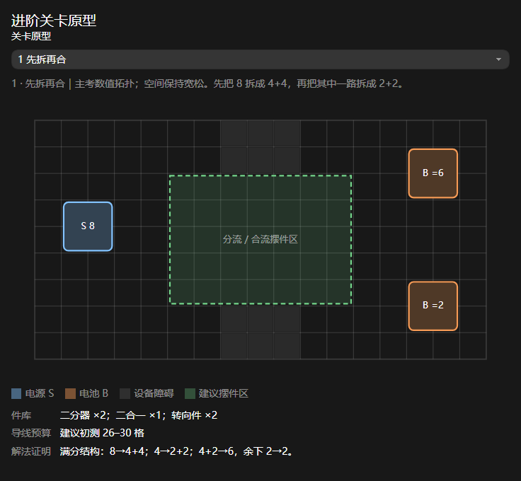
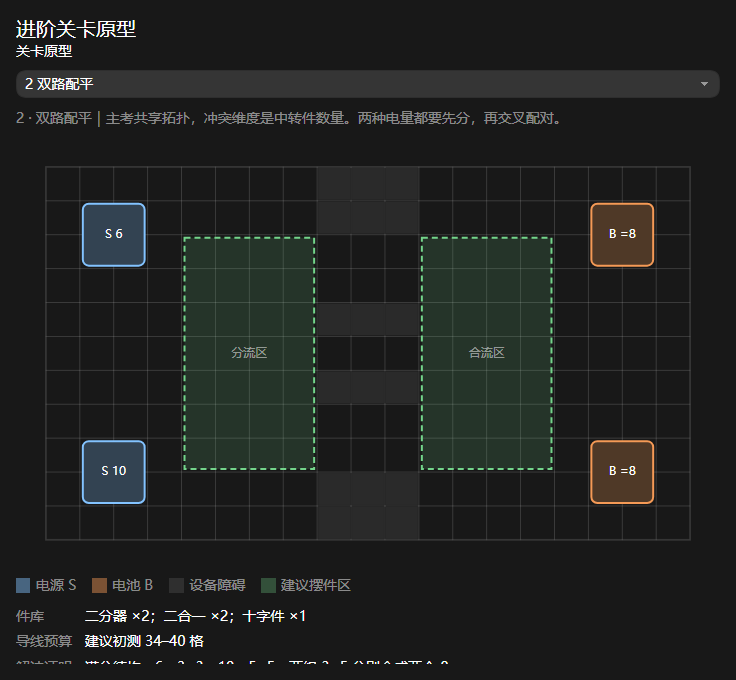
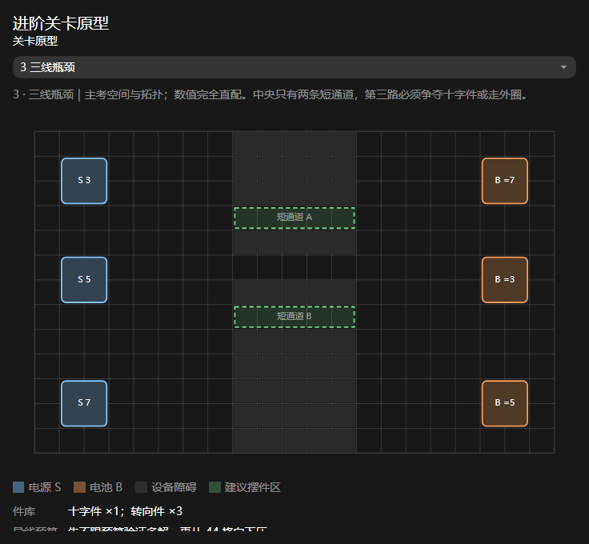
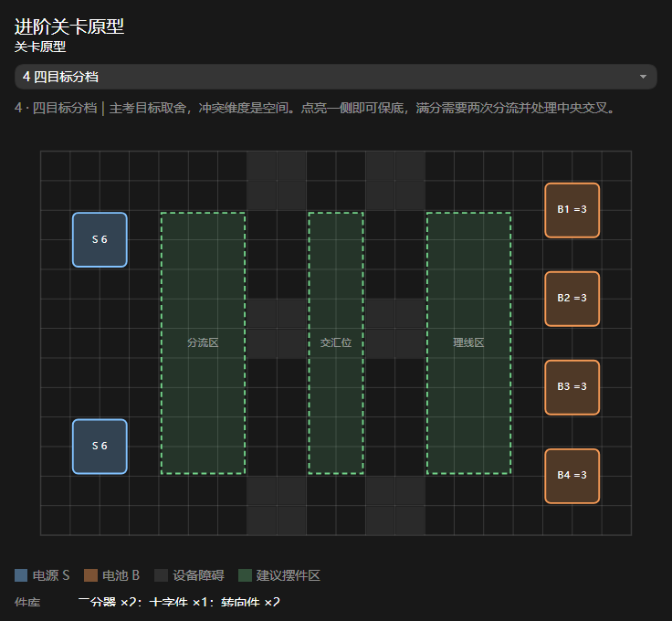

# 关卡原型Test

> 文档定位：记录基于当前修理电路机制设计的进阶关卡原型，供策划在 Unity 关卡编辑器中复刻、跑测和调整难度。
>
> 关联文档：`修理电路关卡设计指南.md`、`修理电路关卡难度设计.md`。
>
> 状态：测试原型。图中布局、件库数量和导线预算均为首轮建议，不代表已经完成可解性与难度验收。

---

## 1. 使用方式

这些原型承接现有 `General_1_Intro00–06` 与 `Step_1_Cross00–01` 教程关，不再教学基础操作，而是尝试让两个已掌握机制发生冲突。

搭建顺序建议：

1. 先按照图示还原端点、障碍与建议摆件区域；
2. 暂时把 `MaxLinkCells` 设为 0，验证题面确实可解；
3. 记录首个可行解所用的中转件和导线格数；
4. 再从文档建议区间的上限开始逐步收紧预算；
5. 观察玩家卡点是否符合原型的主考维度；
6. 如果玩家主要卡在描线或看不懂 Pin，应先调整可读性，不直接降低全部难度。

---

## 2. 原型 1：先拆再合

**难度定位**

- 主考维度：数值拓扑；
- 冲突维度：中转件组合顺序；
- 宽松维度：空间；
- 期望顿悟：分流不只用于服务多个目标，也可以先把电量拆小，再重新合成目标值。

**题面建议**

| 项目 | 配置 |
|---|---|
| 预置电源 | 1 个电源，输出 8 |
| 预置电池 | 精确 6、精确 2，各 1 个 |
| 件库 | 二分器 ×2、二合一 ×1、转向件 ×2 |
| 导线预算 | 初测 26～30 格；首次验证时不限 |
| 满分结构 | `8→4+4`；其中一路 `4→2+2`；`4+2→6`，剩余 `2→2` |

**跑测重点**

- 玩家是否会自然想到对已经分出的 4 再分一次；
- 玩家是否误以为分流器只能直接连接电池；
- 如果解法理解正确但摆件空间不足，应扩大中间区域，而不是改数值。

---

## 3. 原型 2：双路配平

**难度定位**

- 主考维度：共享拓扑；
- 冲突维度：中转件数量与线路交叉；
- 宽松维度：电量计算；
- 期望顿悟：两种电量都先拆分，再把不同来源的一半交叉配对。

**题面建议**

| 项目 | 配置 |
|---|---|
| 预置电源 | 输出 6、输出 10，各 1 个 |
| 预置电池 | 精确 8，共 2 个 |
| 件库 | 二分器 ×2、二合一 ×2、十字件 ×1 |
| 导线预算 | 初测 34～40 格；首次验证时不限 |
| 满分结构 | `6→3+3`，`10→5+5`；两组 `3+5` 分别合成两个 8 |

**跑测重点**

- 玩家是否先把一个目标做完，继而发现剩余电量仍能组成第二个 8；
- 十字件是否真有必要，还是可以用廉价绕行完全跳过；
- 如果十字件只是在减少描线长度，可以先放宽预算，单独验证拓扑是否有趣。

---

## 4. 原型 3：三线瓶颈

**难度定位**

- 主考维度：空间布局；
- 冲突维度：电路拓扑与十字件预算；
- 宽松维度：数值；
- 期望顿悟：三条线路不可能都走最直接的路线，需要选择哪两路在关键位置交叉，哪一路绕行。

**题面建议**

| 项目 | 配置 |
|---|---|
| 预置电源 | 输出 3、5、7，各 1 个 |
| 预置电池 | 精确 3、5、7，各 1 个；上下顺序与电源错位 |
| 件库 | 十字件 ×1、转向件 ×3 |
| 导线预算 | 第一轮不限；确认多解后从约 44 格向下压 |
| 满分结构 | 三组电量均直接匹配，难点只来自路线与瓶颈分配 |

**跑测重点**

- 两条短通道是否真的产生争夺；
- 玩家是否能够看懂哪组端点对应哪组数值；
- 绕行路线是否只是冗长操作；如果是，应缩短外圈但保留线路取舍；
- 十字件放在哪里是否存在两种以上合理答案。

---

## 5. 原型 4：四目标分档

**难度定位**

- 主考维度：多目标与评分取舍；
- 冲突维度：空间与交叉；
- 宽松维度：数值；
- 期望顿悟：先完成同侧目标可以保底，想要满分则需要重新组织两套分流结构和中央通路。

**题面建议**

| 项目 | 配置 |
|---|---|
| 预置电源 | 输出 6，共 2 个 |
| 预置电池 | 精确 3，共 4 个 |
| 件库 | 二分器 ×2、十字件 ×1、转向件 ×2 |
| 导线预算 | 50 分解保持宽松；100 分解初测 38～44 格 |
| 评分结构 | 点亮 2/4 为 50 分；点亮 3/4 为 75 分；点亮 4/4 为 100 分 |

**跑测重点**

- 玩家能否快速获得 50 分，而不是在第一套分流前就被卡住；
- 75 分是否真实存在，还是题面只允许 50/100 两档；
- 为了满分所做的调整是否体现线路优化，而不是全部推倒重画；
- 两个分流器是否都有多个合法落点。

---

## 6. 对比与测试顺序

| 原型 | 主考维度 | 建议测试顺序 | 主要风险 |
|---|---|---:|---|
| 先拆再合 | 数值拓扑 | 1 | 玩家不理解可以连续分流 |
| 双路配平 | 分流、合流共享 | 2 | 线路交叉变成纯理线 |
| 三线瓶颈 | 空间与十字件取舍 | 3 | 外圈绕行过长 |
| 四目标分档 | 多目标与评分优化 | 4 | 只有 50/100，没有自然的 75 分 |

推荐先搭“先拆再合”和“四目标分档”。前者能验证当前数值机制是否足以支撑进阶题，后者能验证部分完成是否真的形成低压力的优化空间。三线瓶颈应最后搭建，因为它最依赖画布尺寸、节点实际占格和 Pin 朝向。
