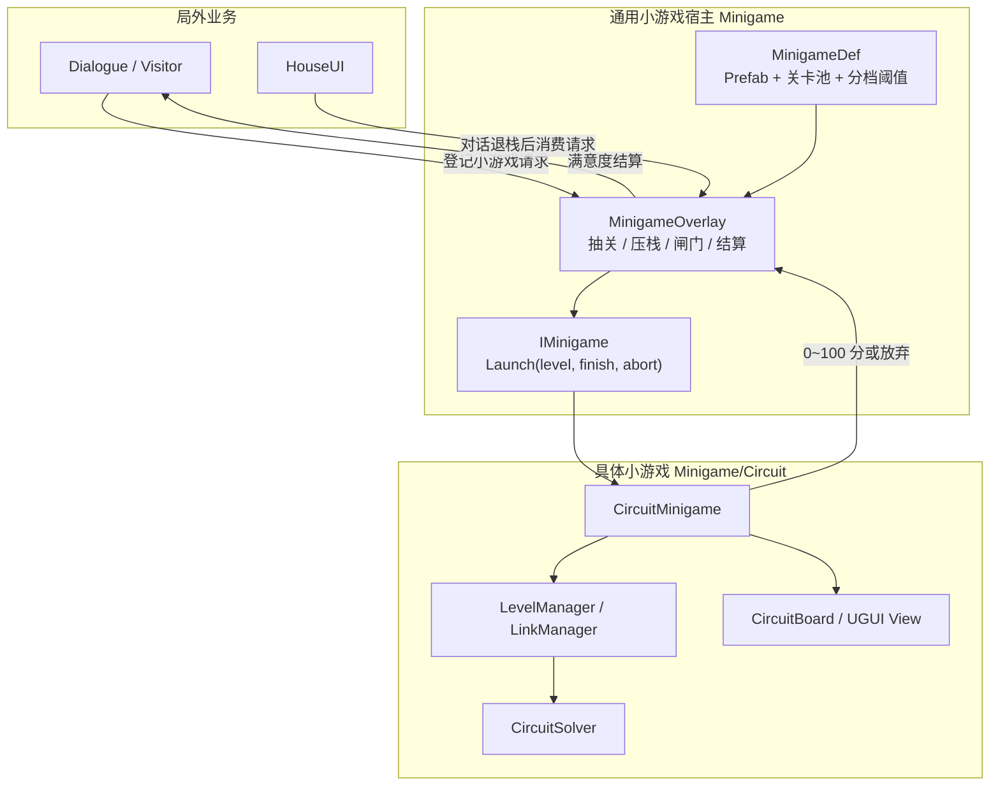
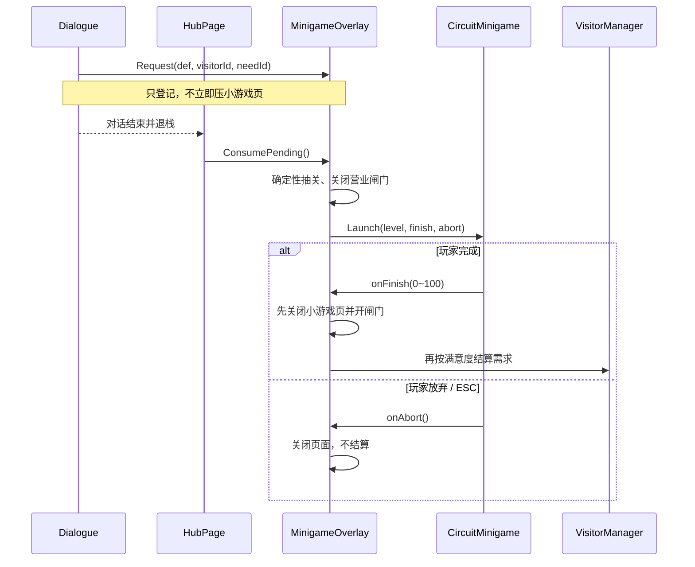
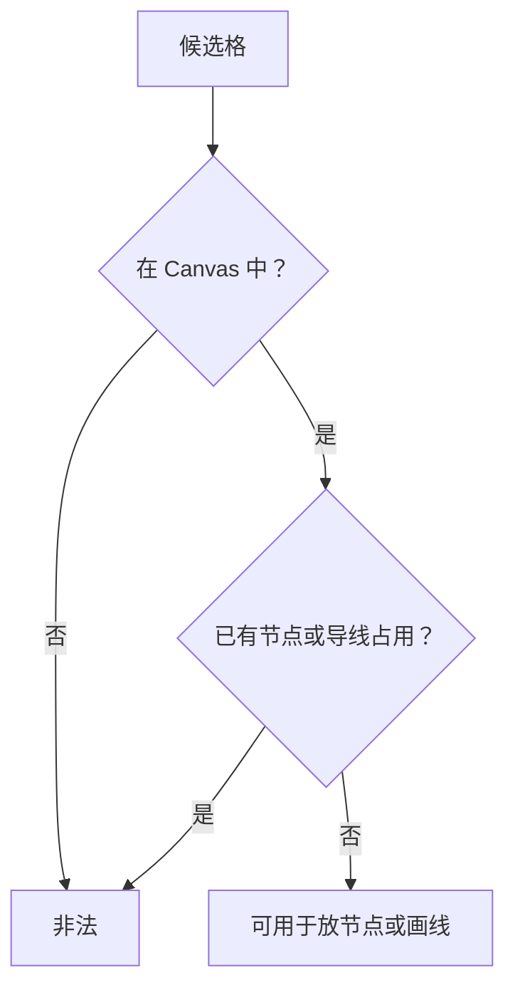
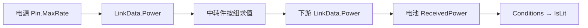
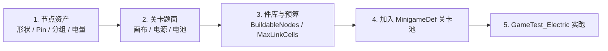

# 小游戏与修理电路技术框架说明（策划版）

> 文件名沿用《节点系统框架说明（策划版）》以避免已有链接失效；正文已按 2026-08-14 的大重构整体更新。
>
> 当前版本：2026-08-15，按工程代码、`Docs/架构设计.md` v0.7 与《小游戏框架与修理电路说明》交叉整理。
>
> 文档定位：面向策划、程序、美术和测试，说明当前工程“实际怎样运行、怎样配内容、哪里可以扩展”。正式架构决策仍以仓库 `Docs/架构设计.md` 为最高技术依据。

---

## 1. 最重要的变化

旧版局内是一套持续运行的节点生产模拟：物资、配方、资源/加工/仓库/中转节点、tick 三阶段运输、暂存、背压和 PlayerCargo。

这条玩法链已经整体退役并从工程删除。当前局内改成：

```text
通用小游戏框架
    └── 第一个具体小游戏：修理电路
            ├── 预置电源
            ├── 玩家摆放中转件
            ├── 玩家描格导线
            ├── 预置电池
            └── 即时求解并返回 0~100 分
```

下列旧概念不应再用于规划当前玩法：

- `ItemDef`、`RecipeDef`、加工节点、仓库节点；
- 固定 tick 的“投递 → 节点 → 取货”流水线；
- 链接持货、运输节拍、在途时间、堵塞和背压；
- 节点生产进入 PlayerCargo；
- 关卡常驻、后台稳态结算和关卡即家具；
- 多线竞争一个 Pin、优先级与轮询；
- A* 自动布线和断线状态机。

仍然继承并继续使用的核心资产是：

- 非规则网格画布；
- 非规则节点形状；
- 节点与导线逐格占用；
- Pin 的格子位置与朝向；
- 玩家手动描格走线与 Manager 层路径复核；
- 关卡编辑器、节点编辑器与画布交互。

---

## 2. 两层架构：通用宿主与具体小游戏



### 2.1 依赖方向硬约束

具体修理电路只认识：

- `IMinigame`；
- 自己的 `LevelDef`、节点、运行时数据与表现。

它不认识：

- `GameManager`；
- `VisitorManager`；
- `EconomyManager`；
- `HouseClockManager`；
- 家具、需求结算或满意度业务。

`MinigameOverlay` 是唯一同时认识局外业务和小游戏契约的宿主。这样以后增加第二种小游戏时，不需要复制访客、对话、页面压栈和结算逻辑。

编辑器生成器是明示例外：它需要同时认识 Prefab、`MinigameDef` 和具体小游戏组件，但只存在于 `UNITY_EDITOR`，不会进入运行时。

### 2.2 分层职责

| 层 | 当前对象 | 职责 |
|---|---|---|
| Model | `MinigameDef`、`LevelDef`、各类 `NodeDef` | 策划静态配置，运行时只读 |
| Runtime Data | `LevelData`、`NodeData`、`PinData`、`LinkData` | 一局内的布局、占用与求解结果 |
| Logic | `LevelManager`、`LinkManager`、`CircuitSolver` | 唯一允许修改运行时数据的入口、合法性与求解 |
| View/Input | `CircuitMinigame`、`CircuitBoard`、各 UGUI View | 展示、输入转译、调用 Manager |
| Host | `MinigameOverlay` | 抽关、页面生命周期、营业闸门、分数结算 |

---

## 3. 通用小游戏框架

### 3.1 `IMinigame`

所有小游戏对宿主只暴露一个入口：

```csharp
void Launch(MinigameLevelDef level, Action<int> onFinish, Action onAbort);
```

契约要求：

- 完成时调用一次且只能调用一次 `onFinish(score)`；
- `score` 必须是 0～100 的整数；
- 放弃时调用 `onAbort()`，不进行业务结算；
- 具体小游戏自行定义分数算法；
- 宿主负责把分数映射成访客满意度。

### 3.2 `MinigameLevelDef`

这是空的 ScriptableObject 基类，只为 `MinigameDef.levels` 提供统一类型约束。

不要把“所有小游戏也许都能用”的字段塞进这里。只有宿主真正需要读取的共同字段才有资格进入基类；具体规则应留在各小游戏自己的关卡类型中。

### 3.3 `MinigameDef`

一个小游戏定义资产包含：

| 字段 | 作用 |
|---|---|
| `minigameId` | 稳定标识，用于日志与确定性抽取 |
| `displayName` | 玩家可见名称 |
| `prefab` | 根节点实现 `IMinigame` 的 Prefab 强引用 |
| `levels` | 该小游戏的关卡池 |
| `plainMin` | 达到“一般”的最低分，默认 1 |
| `satisfiedMin` | 达到“满意”的最低分，默认 60 |
| `perfectMin` | 达到“完美”的最低分，默认 100 |

不同难度暂不建立额外数据层。需要不同难度池时，可以创建多个 `MinigameDef`，复用同一 Prefab、配置不同关卡池与分档阈值。

### 3.4 确定性抽关

```text
关卡下标 = Hash（RunSeed, VisitorInstanceId, NeedId）% 关卡池长度
```

同一位访客、同一个需求反复进入时始终得到同一关，防止玩家通过退出重进刷到简单题。小游戏本体不参与抽取，抽关由宿主完成。

### 3.5 打开与结算时序



“先退哪个页面”是硬时序：入口要等对话页退出后再开小游戏；出口要先关小游戏再触发可能打开完成对话的业务结算。顺序反过来会把错误的 Overlay 弹掉。

### 3.6 时间与存档

- 小游戏不跟随全局固定 tick；小游戏打开期间局外营业闸门关闭；
- 修理电路本身没有时间推进，布局变化后即时求解；
- 一局不存档，每次进入由 `BuildLevel` 新建运行时数据；
- 放弃后再次进入，题目相同但局面重置。

---

## 4. 修理电路的静态数据

### 4.1 `LevelDef`

| 字段 | 当前语义 |
|---|---|
| `Canvas` | 有效画布格集合，可以是非矩形 |
| `PresetNodes` | 题面预置节点及位置、移动/删除权限 |
| `BuildableNodes` | 玩家件库中的中转件与数量上限 |
| `MaxLinkCells` | 全部导线路径格数预算，0 = 不限 |

当前玩法硬规则：

- 电源和电池属于题面，只能预置，不能由玩家摆放、移动或删除；
- 中转件是玩家唯一可以从件库摆放的节点；
- 预置中转件的 `CanMove` / `CanDelete` 可以生效；
- `BuildableNodes` 放入非中转节点时，编辑器会报错，运行时也会拒绝。

### 4.2 `NodeDef`

所有节点共有：

- `DisplayName`；
- 非规则占格形状 `Shape`；
- Pin 布置列表 `Pins`。

当前 `ENodeType` 只有三类：

| 类型 | 类 | 当前作用 |
|---|---|---|
| 电源 | `ResourceNodeDef` | 每个输出 Pin 按自己的 `MaxRate` 供电 |
| 中转件 | `TransitNodeDef` | 根据 PinGroup 与方向进行直通、分流、合流 |
| 电池 | `ConditionNodeDef` | 汇总输入电量并检查点亮条件 |

`Processor` 和 `Storage` 已从枚举与代码删除。

### 4.3 `PinDef` 与 `PinLayout`

`PinDef`：

| 字段 | 当前语义 |
|---|---|
| `MaxRate` | 仅电源输出口有效，表示该口输出电量 |
| `Direction` | `Input` / `Output` / `None`；`None` 表示十字件运行时定向 |
| `PinGroup` | 中转件分组号；-1 表示不属于任何组、不导电 |

`PinLayout`：

- `LocalCell`：Pin 位于节点形状中的哪一格；
- `Facing`：Pin 从该格的上、右、下、左哪一侧接出。

一个 Pin 至多连接一条导线，运行时存储为单个 `PinData.Link`，不再是链接列表。

### 4.4 资产命名

节点资产使用：

```text
A_宽x高_C
```

当前前缀：

| 类型 | A |
|---|---|
| 电源 | `Input` |
| 中转件 | `Con` |
| 电池 | `Cond` |

形状编辑完成后，宽高按实际格子的外接范围自动同步文件名。C 是策划填写的识别符；命名元数据保存在编辑器侧，不进入运行时节点结构。节点实际 SO 类型可在编辑器右侧转换，转换保持资产 GUID，避免关卡引用断裂。

关卡资产使用：

```text
A_难度_C
```

- A：项目设置中维护的分类下拉；
- 难度：1～4；
- C：策划识别符；
- A 的配置入口：`Project Settings > MasterHouse > 关卡命名`。

---

## 5. 运行时数据与占用模型

### 5.1 `LevelData`

一局包含：

- `Def`：关卡静态定义；
- `Nodes`：按稳定 `NodeId` 递增维护；
- `Links`：按稳定 `LinkId` 递增维护；
- 画布格集合；
- 节点和导线共用的占用索引；
- 导线预算派生值。

```text
UsedLinkCells = Σ 每条 LinkData.PathCells.Count
RemainingLinkCells = MaxLinkCells - UsedLinkCells
```

`MaxLinkCells <= 0` 时视为不限。

### 5.2 占用硬规则



- 节点按 `Shape.CellsAt(origin)` 逐格占用；
- 导线按 `PathCells` 逐格占用；
- 不允许假设任何形状是矩形；
- 占用索引只做键查询，不依赖 Dictionary 枚举顺序。

### 5.3 Manager 写权限

| 类 | 唯一职责 |
|---|---|
| `LevelManager` | 建局、节点放置/移动/删除、节点数量资格与占格检查 |
| `LinkManager` | 建线方向解析、成环检查、路径完整复核、建线与删线 |
| `CircuitSolver` | 从现有布局纯函数计算电量、电池点亮和分数 |

View 与输入层不能直接修改 `LevelData`；所有操作必须经过 Manager。

---

## 6. 电量求解

### 6.1 三条规则

1. 电源的每个输出 Pin 输出自己的 `MaxRate`；
2. 中转件每个输出口得到 `floor(组内输入总量 / 组内输出口总数)`；
3. 电池汇总全部输入 Pin 的电量，逐条检查 `RequiredAmount` 与 `AllowExcess`。



### 6.2 中转件统一公式

```text
每个输出口 = floor（同组输入之和 ÷ 同组输出口总数）
```

| 配置 | 结果 |
|---|---|
| 1 入 1 出 | 直通/转向，输出等于输入 |
| 1 入 N 出 | 分流，每个出口平均分配并向下取整 |
| N 入 1 出 | 合流，输出等于输入之和 |
| 两个独立 1 入 1 出组 | 十字立交，两路电互不相通 |

未连接的输出口仍计入分母；未接份额和整除余数直接损耗。这是有意的谜题规则，不是运输损耗状态。

### 6.3 电池判定

对每条 `ConditionEntry`：

```text
收到量 < RequiredAmount                      → 不亮
收到量 = RequiredAmount                      → 点亮
收到量 > RequiredAmount 且 AllowExcess=true  → 点亮
收到量 > RequiredAmount 且 AllowExcess=false → 不亮
```

条件列表之间是“全部满足”。当前没有不同电种，所有条件检查同一个总收到量，因此内容生产建议一块电池先只配一条条件。

### 6.4 纯函数与调用时机

`CircuitSolver` 没有 tick 和内部状态。每次布局改变后：

```text
Manager 修改数据
    → CircuitSolver.Solve(level)
    → 写回 Link.Power / Pin.OutPower / Battery.ReceivedPower / IsLit
    → Manager 广播事件
    → View 刷新
```

“先求解再广播”保证订阅方读到的一定是完整新结果。

### 6.5 成环

建线前调用 `CircuitSolver.WouldCreateCycle`。合流器若把输出绕回输入，会形成自指方程，因此直接拒绝。

成环图顶点不是“节点”，而是“节点 + PinGroup”。十字件的两个组互不导通；若只按节点检测，会把合法交叉误判为回环。

---

## 7. 玩家交互与路径校验

### 7.1 描格手感

- 从 Pin 按下，路径起点是 Pin 朝向外侧的相邻格；
- 鼠标移动到新格时，路径逐格延伸；
- 回到已有路径格会截断到该格；
- 斜向跨格时补曼哈顿路径，优先沿上一段方向再转弯；
- 遇到越界、占用、自交或预算耗尽时停止延伸，不废掉已经画好的前半段；
- 松手时必须接到合法目标 Pin，否则整次作废；
- 可以从输入端开始反向描画，Manager 会规整存储方向。

### 7.2 Manager 完整复核

`LinkManager` 不信任交互层传来的路径，重新检查：

1. 两端 Pin 有效且不属于同一节点；
2. 两端都没有已有导线；
3. 能解析成一输出、一输入；
4. 不会形成回路；
5. 路径首尾落在正确接口格；
6. 每格在画布内且未占用；
7. 四方向连续且不自交；
8. 未超过导线预算。

### 7.3 中转件运行时方向

十字件的 1 入 1 出组可以把两个 Pin 都配置为 `Direction=None`。第一条连接决定当前 Pin 是输入还是输出，同组另一个 Pin 自动取反；整组断线后恢复未定向。

两个都未定向的 Pin 不能直接互连，因为没有电源或电池帮助系统判断流向。

### 7.4 移动与删除

- 从件库摆下的中转件默认可移动、可删除；
- 预置中转件按 `CanMove` / `CanDelete`；
- 电源和电池按类型硬限制为不可移动、不可删除；
- 移动或删除中转件前，所有附着导线直接删除并返还导线预算；
- 非法落点不产生临时状态，操作直接失败。

---

## 8. 得分、完成与局外结算

修理电路得分：

```text
Score = round（点亮电池数 / 电池总数 × 100）
```

无电池是关卡配置错误，得分返回 0。玩家可以随时完成，没有额外失败状态。

`MinigameDef.Evaluate` 按阈值把分数映射成：

- 不对味；
- 一般；
- 满意；
- 完美。

完成后宿主把满意度交给访客需求结算。放弃不结算，访客仍保持服务中，可再次进入同一关重试。

当前得分只看点亮比例，不直接奖励：

- 少用导线；
- 少用中转件；
- 更短时间完成；
- 解法是否美观。

这些可以作为玩家自我优化目标，但若要进入正式评分，需要新增明确规则。

---

## 9. UGUI 表现与 Prefab

修理电路是全屏 UGUI 叠加层，不使用世界空间 SpriteRenderer 或专用 Camera。

主要结构：

```text
CircuitMinigame.prefab
├── 顶部预算：导线 / 中转件 / 已点亮
├── 左侧件库：模板 Prefab 动态克隆
├── 中央画布：Grid / Node / Link / Preview 分层
└── 完成 / 放弃按钮
```

`CircuitMinigameView` 是序列化引用容器；`CircuitMinigame` 负责生命周期和刷新；`CircuitBoard` 负责格子布局、渲染对象重建与输入处理。

Prefab 是布局唯一真相源。缺少必需引用时记录错误并放弃本局，不通过代码临时生成另一套兜底界面。

当前强引用资产：

- `Assets/GameData/Minigames/CircuitMinigame.prefab`；
- `Assets/GameData/Minigames/Minigame_修理电路.asset`。

生成入口：

```text
MasterHouse > 小游戏 > 创建修理电路资产（补齐缺失）
```

重建 Prefab 会覆盖手调布局，工具应二次确认后使用。

---

## 10. 策划编辑器与配置流程

### 10.1 节点编辑器

菜单：`MasterHouse > 节点编辑器`

支持：

- 创建、选择与转换电源/中转件/电池资产；
- 绘制非规则节点形状；
- 滚轮缩放、中键平移；
- Pin 列表与画布双向摆放、拖动；
- Esc 取消 Pin 摆放；
- 配置 Pin 方向、组号、输出电量、位置与朝向；
- 中转件快捷添加 1 入 1 出、1 入 N 出、N 入 1 出分组；
- 保存时归一化形状并同步尺寸文件名；
- 类型规则与 PinGroup 校验。

资产位置：`Assets/GameData/Nodes/`

### 10.2 关卡编辑器

菜单：`MasterHouse > 关卡编辑器`

支持：

- `A_难度_C` 新建命名；
- 默认视野 25×15；
- 逐格、矩形和一键矩形生成画布；
- 滚轮缩放、中键平移；
- 预置节点列表与画布摆放；
- 配置 `BuildableNodes` 与 `MaxLinkCells`；
- 越界、重叠、电源、电池、总供需、评分粒度与预算校验；
- 保存时将画布归一化到左下原点。

资产位置：`Assets/GameData/Levels/`

### 10.3 推荐内容生产顺序



---

## 11. 目录地图

```text
Assets/Scripts/Minigame/
├── IMinigame.cs
├── MinigameDef.cs
├── MinigameLevelDef.cs
├── MinigameOverlay.cs
└── Circuit/
    ├── Data/       LevelDef、NodeDef、PinDef、GridGroup
    ├── Runtime/    LevelData、NodeData、LinkData、Manager、Solver
    ├── View/       CircuitMinigame、CircuitBoard、UGUI View
    └── Editor/     关卡/节点编辑器、画布工具、Prefab 生成器

Assets/GameData/
├── Levels/         修理电路关卡资产
├── Nodes/          电源、中转件、电池资产
└── Minigames/      小游戏 Prefab 与 MinigameDef

Assets/Scenes/
├── GameTest_Electric.unity   修理电路独立测试
└── OutGameTest.unity         局外完整链路测试
```

---

## 12. 当前校验规则

节点编辑器会提示：

- 形状为空、重复格；
- Pin 不在形状内、朝向被自身形状挡住、位置朝向重合；
- 电源没有输出口或输出电量 ≤ 0；
- 电池没有输入口、没有条件、需求电量 ≤ 0；
- 中转 Pin 未分组；
- 分组缺输入或缺输出；
- `Direction=None` 的使用不符合 1 入 1 出同步组；
- M:N 分组未经当前版本验收。

关卡编辑器会提示：

- 画布为空、重复格；
- 预置节点越界或重叠；
- 可建列表空引用、重复、数量小于 1；
- 可建列表混入非中转节点；
- 没有电源或没有电池；
- 电源总供电小于电池总需求，无法全亮；
- 电池过少导致评分档位过粗；
- 导线预算大于全部空闲格，等同不限；
- 导线预算小到大概率无法接通所有电池。

这些校验多为内容风险提示，不等同于完整可解性证明。复杂关卡仍需要策划记录一份实际解法并在运行时验收。

---

## 13. 当前状态与内容缺口

截至 2026-08-15：

- 通用小游戏契约、宿主、确定性抽关与访客结算已接通；
- 修理电路数据、求解、描格、件库、预算、计分和 UGUI 代码已落地；
- `CircuitMinigame.prefab` 与 `Minigame_修理电路.asset` 已存在；
- `GameTest_Electric` 与 `OutGameTest` 场景已存在；
- 正式编辑器内全链路验收仍需按仓库验收清单执行；
- 四张已跟踪的 `General_1_Intro*` 关卡其 `BuildableNodes` 仍为空，正式件库内容尚未补齐；
- 当前已有十字中转资产，但分流器和合流器资产仍需制作与验收；
- 部分旧节点资产保留了迁移前的内部名称或失效字段，需要逐项清理；
- 访客日程表若未把需求指向 `Need_修理电路`，局外链路不会自然触发小游戏。

这些属于内容和验收缺口，不代表核心求解框架尚未实现。

---

## 14. 扩展时的判断边界

### 14.1 只加资产即可完成

- 新的画布与关卡；
- 新电源形状、Pin 数量、朝向与输出值；
- 新电池形状、输入口和需求值；
- 新的 1:N 分流器、N:1 合流器、十字/转向件；
- 新关卡池或不同分档阈值的 `MinigameDef`；
- 调整中转件数量与导线预算。

### 14.2 需要程序改动

- 旋转中转件；
- 创建后拖排已有导线；
- 开关、延迟、脉冲、充放电等时间机制；
- 多种电类型或颜色匹配；
- 线路过载、Pin 总带宽；
- 允许玩家摆放电源或电池；
- 电池权重、导线效率、用时等新评分维度；
- 跨局保存电路；
- M:N 中转件正式支持与完整交互验证。

### 14.3 新增另一种小游戏

新增小游戏应：

1. 新建自己的 `MinigameLevelDef` 子类；
2. 新建实现 `IMinigame` 的 Prefab 根组件；
3. 只通过 `onFinish` / `onAbort` 与宿主通信；
4. 创建对应 `MinigameDef` 并配置关卡池；
5. 不引用局外 Manager；
6. 把表现全部留在自己的目录与 Prefab 中。

不要把修理电路的节点、导线或 Solver 提升成所有小游戏必须依赖的框架。通用层只提供真正跨小游戏的生命周期契约。

---

## 15. 验收重点

### 通用链路

- 对话事件登记请求后，小游戏在对话退栈完成后打开；
- 打开期间时钟和访客倒计时停止，关闭后恢复；
- 同一访客反复进入抽到同一关；
- 完成只结算一次，放弃不结算；
- 完成小游戏后触发的对话层不会被错误弹栈。

### 修理电路

- 描格撞墙停住、回退截断、非法终点作废；
- 导线预算耗尽停止延伸，删线正确返还；
- 一个 Pin 不能接第二条线；
- 成环连接被拒绝；
- 中转件数量上限、移动、删除正确；
- 移动/删除中转件时附着导线清除并返还预算；
- 电源每个输出口按 `MaxRate` 独立供电；
- 分流按全部输出口数量计算并向下取整；
- 合流正确求和；
- 十字两个分组互不串电；
- 电池过量规则正确；
- 点亮比例与 0～100 分换算正确；
- 分辨率变化后 UGUI 网格重新布局且输入坐标仍准确。

---

## 16. 文档入口与维护

| 目的 | 文档 |
|---|---|
| 权威架构与硬约束 | `Docs/架构设计.md` |
| 本次重构的决策和落地过程 | `Docs/待办工作流/小游戏框架与修理电路说明.md` |
| 策划关卡方法论 | `Assets/Developers/taslopece/MiniGame_Electric/修理电路关卡设计指南.md` |
| 本文 | 当前实现的策划可读技术地图 |

更新规则：

- 代码是“现在实际做了什么”的最终证据；
- `Docs/架构设计.md` 是“为什么这样设计、必须遵守什么”的权威依据；
- 本文只总结当前稳定框架，不复制完整历史；
- 若通用小游戏契约、修理电路求解规则、关卡字段或目录发生变化，应同步更新本文；
- 探索性关卡想法只写入关卡设计文档，不直接升级为技术硬规则。
